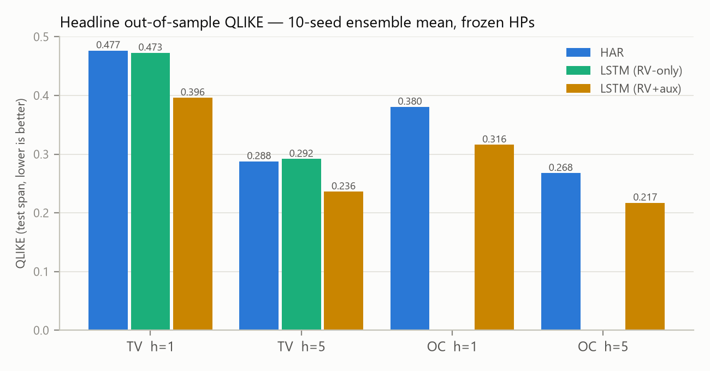
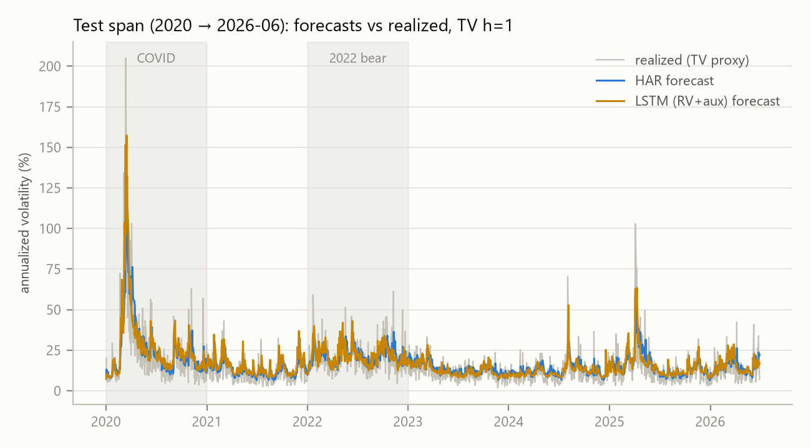
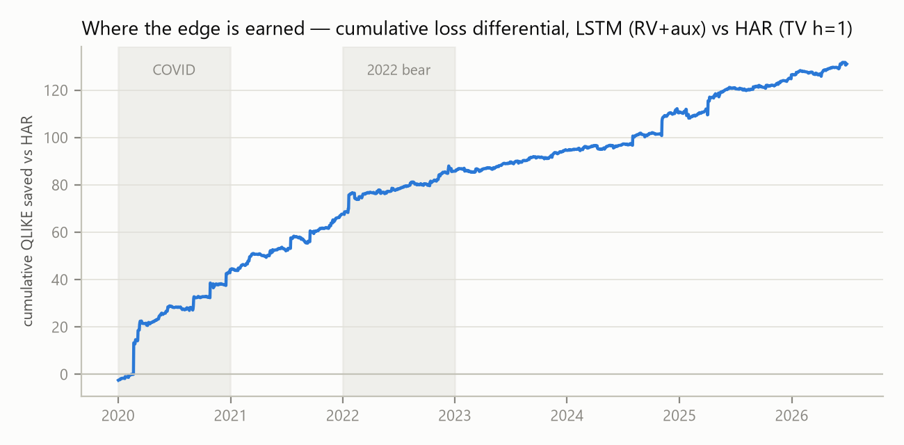
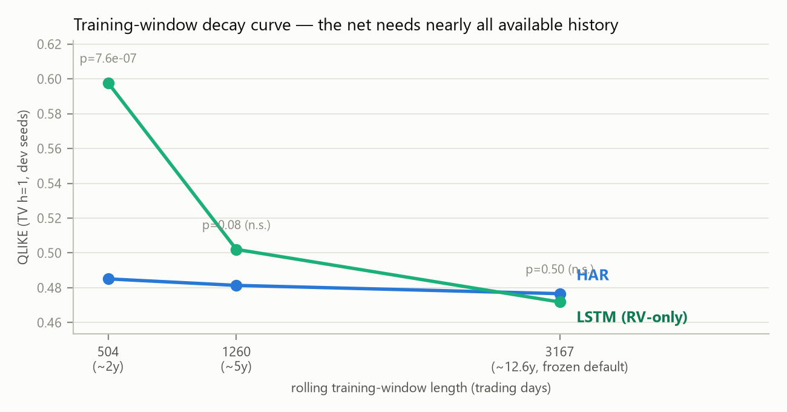

# Can a Small LSTM Beat HAR? Honest Measurement of a Deep-Learning Edge in Daily Range-Based Volatility Forecasting

**MTH 5320 Deep Learning — Project 2**
Strider Settgast · 2026-07-06
Repository: `realized-volatility-prediction` (code, frozen data snapshot, and all result artifacts)

---

## Abstract

We test whether a small LSTM can out-forecast the HAR model on daily SPY range-based volatility targets, under a validation protocol designed to make self-deception structurally difficult: a frozen, checksummed data snapshot; chronological walk-forward evaluation with an embargo; hyperparameters tuned once and frozen before any test contact; 10-seed ensembles; and pre-registered Diebold–Mariano inference with all p-values reported together. Three findings. **(1)** HAR is confirmed as the bar to beat: it tops a pre-specified classical field (persistence, EWMA, AR(1), GARCH(1,1)) on every target/horizon block, with only GARCH statistically indistinguishable on the total-variance target. **(2)** Given only the target's own history, the LSTM has no edge — a genuine null (p = 0.585 and 0.667 at h=1 and h=5). **(3)** Adding a small set of pre-registered auxiliary features (SPY returns and volume, VIX-derived) to the *same frozen architecture and hyperparameters* produces a large, robust edge over HAR on **every** target and horizon tested: QLIKE improvements of 17–19%, DM p-values from 4.9×10⁻⁸ to 9.7×10⁻⁵, with 100% seed agreement. Because the RV+aux model also beats the RV-only model decisively, the edge is attributable to the auxiliary information, not the architecture. The edge is present in every test-span regime (COVID 2020, calm 2021, the 2022 bear, 2023–26 recovery), and a training-window decay study shows the network needs nearly all ~12.6 years of available history to be competitive at all. All results replay from committed artifacts without retraining.

---

## 1. Research questions

Volatility is highly forecastable, and HAR — three OLS terms on daily, weekly, and monthly lagged volatility — is famously hard to beat. That reputation was earned on high-frequency realized variance; this project is constrained to daily OHLC data, so its targets are daily *range-based* variance proxies, a distinct estimator family. "Does HAR's dominance transfer?" is untestable by any single project (dominance is a claim about the whole competitor field of the literature), so the questions were scoped to what this design can actually answer:

1. **Is HAR the strongest classical model here**, against a pre-specified field — persistence, EWMA, AR(1) on log-target, GARCH(1,1)?
2. **Can a small LSTM add signal beyond HAR?**
3. **Where does any edge live?** — pre-registered cuts by *source* (features vs architecture), *horizon*, *target*, and *regime*.

A single model family only ever establishes a **lower bound** on extractable signal; no ceiling claim is made anywhere in this report. A rigorously validated tie would have been a real result; the project pre-committed to reporting wherever the numbers landed.

## 2. Data and targets

**Data.** One asset (SPY), daily OHLCV from Stooq plus daily CBOE VIX OHLC, frozen as a committed, SHA-256-checksummed snapshot with a pinned end date of **2026-06-30**. No module pulls live data at experiment time. (Stooq login-gates CSV export; the SPY leg is a manual export from a logged-in session, canonicalized and checksummed by `scripts/freeze_snapshot.py` — a ratified amendment that leaves the freeze-and-checksum contract unchanged.) Returns and the overnight leg use the adjusted price basis throughout; adjusted and raw prices are never mixed inside one estimator.

**Targets.** Both are daily *variances* (never volatilities), modeled in log space and exponentiated back for scoring:

- **TV (primary), total daily variance:** per-day Rogers–Satchell + squared overnight (close-to-open) return. Approximately conditionally unbiased for *total* daily variance — the Patton (2011) property that licenses QLIKE ranking and DM inference for it. Not adjustment-invariant (the overnight leg crosses ex-dividend boundaries), hence the adjusted basis requirement.
- **OC (secondary), open-to-close variance:** per-day Garman–Klass. Conditionally unbiased for the *trading session* only; every OC claim in this report is scoped to that object and never extended to total daily volatility.

Calibration diagnostics (S8) checked both proxies against squared-return benchmarks on the train span and passed within the pre-set tolerance band [0.8, 1.25].

## 3. Methodology

### 3.1 Splits, retraining, and leakage control

Chronological three-way split: **train 2005–2017, validation 2018–2019, test 2020 → 2026-06-30**, with an embargo gap auto-resolved to the maximum model lookback (66 trading days) so no lookback window straddles a boundary. Inside the test region, models are re-fit on a **monthly walk-forward** cadence (78 folds) using a **fixed-length rolling window** equal to the initial train span (3,167 trading days) — a finite-memory scheme that keeps re-estimated forecast comparisons within the Giacomini–White framework. Tuning touched train/validation only; the test region was touched exactly once per pre-registered experiment.

Leakage is controlled by construction and by test: every feature at day *t* uses only information known at the close of *t* (verified by a future-perturbation test: perturbing data after *t* must leave the day-*t* feature unchanged); scalers are fit on training indices only; the series is never shuffled. All shared logic — one splitter, one QLIKE/RMSE/DM implementation, both target constructions — lives in a single tested library (`src/`, 116 passing tests), so no two experiments can disagree on definitions.

### 3.2 Models

**Classical field** (research question 1): persistence (today's value; at h=5, the trailing 5-day mean), EWMA on the lagged target (decay fit on train), AR(1) on the log-target, **HAR** fit on the log-target with the lognormal back-transform (pre-registered; Corsi's level-space HAR is not fielded), and GARCH(1,1) fit on close-to-close returns. GARCH's forecast object is *total* return variance, so it is properly scored against TV; where shown against OC the object mismatch is flagged in the table.

**Network:** a deliberately small LSTM (frozen family; the enemy at this data scale is overfitting, not lack of capacity), trained on the QLIKE-with-floor loss directly. The MSE-of-log fallback never triggered — all 10 seeds trained on QLIKE in every experiment. Training is CPU-only with full seeding for determinism.

### 3.3 Tuning and frozen controls

Hyperparameters were tuned **once**, with a 50-trial Optuna search on the TV target at h=1, using train/validation data only, and then frozen (best validation QLIKE 0.4027):

| hidden | layers | dropout | lr | weight decay | batch | seq. length |
|---|---|---|---|---|---|---|
| 100 | 1 | 0.096 | 3.6×10⁻⁴ | 4.8×10⁻⁵ | 64 | 28 |

Two reuse decisions are design choices and should be read as such. **First, the h=1-tuned hyperparameters were reused unchanged for h=5 — h=5 was never tuned separately.** **Second, the same frozen set was reused unchanged on the OC target.** Both reuses can only *handicap* the network, never manufacture an edge, and they are what keeps the comparisons controlled: across the RV-only and RV+aux experiments the architecture, hyperparameters, window length, and retrain cadence are identical, so the only varying factor is the feature set — which is exactly what makes "where does the edge live" interpretable. Any gain under frozen HPs is a conservative lower bound. The freeze commit predates all test-region contact and serves as the pre-registration.

### 3.4 Feature sets

- **RV-only:** lagged log-target (lags 0–21) plus 5-day and 22-day log aggregates — the same information HAR sees, in flexible form.
- **RV+aux:** the RV-only set plus a pre-registered auxiliary menu, frozen before any Stage-2 test contact — **Tier 2:** SPY daily return, |return|, overnight return, volume ratio; **Tier 3:** log VIX, VIX change, VIX-implied daily variance. Each feature is close-of-day-available and never revised.

### 3.5 Evaluation and inference

**QLIKE** in variance space is primary (it penalizes under-forecasting risk, the costly direction, and is ranking-robust to proxy noise under conditional unbiasedness); **RMSE** is reported alongside. Predictions are floored at a pre-specified positive value fixed at data freeze (TV 3.667×10⁻⁶, OC 2.607×10⁻⁶) and the floor bind-rate is logged every run. Headline numbers use **10 seeds**; the pre-specified object of inference is the **seed-ensemble mean** prediction sequence. Significance uses **Diebold–Mariano with the Harvey–Leybourne–Newbold small-sample correction** and HAC (Bartlett) variance with lag 7 ≥ h−1 (the h=5 target is a 5-day average, so daily loss differentials are serially correlated by construction). A claimed edge requires DM **p < 0.05 on the ensemble mean *and* a same-sign per-seed mean loss differential in ≥ 80% of seeds** (criterion S6). All DM p-values are reported together — never a curated subset.

## 4. Results

The test span is 2020-01 → 2026-06 (n = 1,630 forecasts at h=1; 1,626 at h=5). All tables are out-of-sample, seed-ensemble means over 10 seeds for the LSTMs.

### 4.1 The bar is real: HAR tops the classical field (Q1)

| Model | TV h=1 QLIKE | TV h=5 QLIKE | OC h=1 QLIKE | OC h=5 QLIKE |
|---|---|---|---|---|
| Persistence | 1.0239 † | 0.4275 | 0.6803 † | 0.3904 |
| EWMA | 0.5597 | 0.3654 | 0.4756 | 0.3483 |
| AR(1) log | 0.5728 | 0.3476 | 0.4290 | 0.3048 |
| GARCH(1,1) | 0.4822 | 0.2993 | 0.4731 ‡ | 0.3410 ‡ |
| **HAR (log)** | **0.4766** | **0.2877** | **0.3805** | **0.2677** |

† persistence at h=1 tripped the floor bind-rate flag (0.49% TV / 0.37% OC of predictions floored, above the 0.1% S8 threshold) — its h=1 QLIKE should be read with that caveat. ‡ GARCH forecasts total return variance; scoring it against OC is an object mismatch, flagged per protocol.

DM vs HAR, all sixteen p-values (positive mean loss differential = HAR better):

| vs HAR | TV h=1 | TV h=5 | OC h=1 | OC h=5 |
|---|---|---|---|---|
| Persistence | 2.9×10⁻¹⁴ | 1.6×10⁻⁶ | 1.6×10⁻¹⁵ | 7.4×10⁻⁷ |
| EWMA | 4.0×10⁻⁶ | 1.1×10⁻⁴ | 2.9×10⁻⁷ | 1.8×10⁻⁴ |
| AR(1) log | 1.3×10⁻⁵ | 3.6×10⁻⁵ | 3.8×10⁻⁴ | 1.6×10⁻³ |
| GARCH(1,1) | 0.637 | 0.370 | 7.5×10⁻⁷ ‡ | 4.5×10⁻⁴ ‡ |

HAR beats everything significantly except GARCH on TV, where it leads numerically but the difference is statistically indistinguishable (p = 0.64 and 0.37). "HAR is hard to beat" is therefore a *finding on this target*, not imported folklore — and HAR is the correct benchmark for the network.

### 4.2 Architecture alone finds nothing: the RV-only LSTM is a null result (Q2, part 1)

With only target history as input, the tuned LSTM neither beats nor loses to HAR:

| TV target | LSTM (RV-only) QLIKE | HAR QLIKE | DM stat | p | seed agreement |
|---|---|---|---|---|---|
| h=1 | 0.4726 | 0.4766 | −0.55 | 0.585 | 60% |
| h=5 | 0.2917 | 0.2877 | +0.43 | 0.667 | 90% (favoring HAR) |

Neither horizon comes near the S6 criterion. RMSE agrees (HAR slightly better on both). This is a legitimate null, consistent with the classical-field result: given the same information HAR uses, a flexible sequence model recovers HAR-level performance and nothing more.

### 4.3 The auxiliary features reverse the null decisively (Q2, part 2)

Adding the pre-registered Tier 2+3 auxiliary features to the *identical* frozen architecture and hyperparameters:

| Block | LSTM (RV+aux) | HAR | ΔQLIKE | DM stat | p vs HAR | seed agreement |
|---|---|---|---|---|---|---|
| TV h=1 | **0.3962** | 0.4766 | −16.9% | −5.48 | 4.9×10⁻⁸ | 100% |
| TV h=5 | **0.2361** | 0.2877 | −17.9% | −3.74 | 1.9×10⁻⁴ | 100% |
| OC h=1 | **0.3160** | 0.3805 | −16.9% | −5.11 | 3.7×10⁻⁷ | 100% |
| OC h=5 | **0.2172** | 0.2677 | −18.9% | −3.91 | 9.7×10⁻⁵ | 100% |

Every block clears S6 by orders of magnitude, with unanimous seed agreement. RMSE (secondary) also favors the network on TV (h=1: 5.00×10⁻⁴ vs 5.14×10⁻⁴; h=5: 3.76×10⁻⁴ vs 4.02×10⁻⁴) and is essentially tied at OC h=1; at OC h=5 RMSE favors HAR (1.64×10⁻⁴ vs 1.54×10⁻⁴) while QLIKE strongly favors the network — consistent with the network winning where QLIKE weights accuracy (avoiding under-forecasts of risk) rather than on symmetric squared error. We report both and rank on the pre-specified primary.

### 4.4 Where the edge lives (Q3, pre-registered cuts)

**Source — features, not architecture.** The RV+aux network also beats the RV-only network head-to-head: TV h=1 p = 7.2×10⁻⁹ (DM −5.82), TV h=5 p = 4.3×10⁻⁵ (DM −4.10), both 100% seed agreement. Combined with §4.2's null, the attribution is clean: essentially **all** of the edge comes from the auxiliary information (chiefly the VIX/return/volume block), none from the sequence architecture itself.

**Horizon — present at both.** The edge survives the harder h=5 task at nearly the same relative size (−17.9% vs −16.9% QLIKE), despite h=5 reusing hyperparameters tuned at h=1.

**Target — present on both.** The story does not change when overnight variance enters the target (TV) or is excluded (OC); relative improvements are 17–19% everywhere.

**Regime — present in every sub-period.** QLIKE by test-span regime, TV h=1 (DM vs HAR, HAC lag 7; sub-period boundaries are calendar years matching the protocol's description of the span — COVID, calm, 2022 bear, recovery — but were not pre-registered as dates, so these p-values are descriptive):

| Regime (TV h=1) | n | HAR | LSTM (RV-only) | LSTM (RV+aux) | aux ΔQLIKE | p (aux vs HAR) | seed agr. |
|---|---|---|---|---|---|---|---|
| COVID 2020 | 253 | 0.6911 | 0.6736 | **0.5161** | −25.3% | 0.009 | 100% |
| Calm 2021 | 252 | 0.4906 | 0.4831 | **0.3976** | −18.9% | 0.002 | 100% |
| Bear 2022 | 251 | 0.3924 | 0.3548 | **0.3202** | −18.4% | 0.037 | 100% |
| Recovery 2023–26 | 874 | 0.4346 | 0.4453 | **0.3828** | −11.9% | 9.8×10⁻⁵ | 100% |

The same pattern holds on the other three blocks: the RV+aux mean loss differential is negative (network better) in **all 16 regime × block cells** with 90–100% seed agreement in every cell; per-regime significance at h=5 and in the 2022 bear is weaker (p between 0.05 and 0.56 in five of the sixteen cells) as expected from ~250-observation sub-samples with overlapping h=5 losses (full table: `results/report/regime_cut.json`). The largest relative gain is in the COVID regime — the network is at its best exactly where HAR is at its worst — but the edge is *not* a single-crisis artifact:

The cumulative loss differential rises steadily across the whole six-and-a-half-year span; no regime, including the calm ones, gives any of the edge back.

**Training-window decay — why the frozen window mattered.** Re-running the RV-only comparison (TV h=1, dev seeds) at three rolling-window lengths:

At ~2 years of history HAR beats the network decisively (QLIKE 0.485 vs 0.598, p = 7.6×10⁻⁷); at ~5 years HAR still leads (p = 0.084); only at the full ~12.6-year frozen default does the network reach parity (p = 0.50). The data-hungry network needs nearly all available history just to tie a 3-parameter regression on the same information — useful context for anyone hoping to deploy such models on shorter histories.

## 5. Limitations and threats to validity

- **Multiplicity.** Many pairwise DM tests are reported; individual p-values overstate family-wise evidence. Mitigations: *all* p-values are reported together, and the headline results are far below any reasonable correction (the largest headline p is 1.9×10⁻⁴ across 4 pre-registered comparisons). A Model Confidence Set is the named upgrade.
- **DM stationarity.** The loss-differential stationarity assumption is strained by a regime-heavy test span (COVID, 2022). The regime cut is the mitigation, not a rug: the edge holds within every sub-period.
- **Proxy validity.** All claims are scoped to the object each proxy is conditionally unbiased for — TV claims speak to total daily variance, OC claims to the trading session only. Both proxies passed the calibration band on train; the QLIKE floor bound on 0% of network or HAR test predictions (only persistence at h=1 tripped the flag).
- **Regime-cut boundaries** were not pre-registered as dates (the *cut itself* was); calendar years were chosen for transparency, and the per-regime p-values are labeled descriptive.
- **Conservatism of frozen HPs** cuts both ways: the reported edge is a lower bound, but per-horizon or per-target tuning was deliberately not explored, so nothing is claimed about the tuned-per-task ceiling.
- **Statistical, not economic.** No transaction-cost or vol-targeting backtest was run; converting this QLIKE edge into money is a separate, specced follow-on. One asset (SPY); multi-asset robustness is future work. The forecastability *floor* of each proxy (what an ideal forecaster could achieve) was not estimated, so no ceiling claim is made.

## 6. Reproducibility

Everything replays. The repo contains the frozen snapshot (SHA-256 manifest, pinned end date), pinned requirements, the shared `src/` library with 116 passing tests (including the future-perturbation leakage test, splitter overlap/embargo checks, and DM/QLIKE fixtures), thin experiment scripts (`scripts/run_stage0.py`, `run_stage1.py`, `run_stage2.py`), and every run's `config.json` / `preds.parquet` / `metrics.json` committed under `results/`. The headline tables and all four figures in this report are regenerated from those committed artifacts — re-running **no** training — by `scripts/make_report_assets.py`, which also asserts its replayed QLIKE matches the committed values. Seeds are fixed; training is CPU-only to avoid CUDA non-determinism.

## 7. Conclusion

On daily SPY range-based volatility, HAR is confirmed as the bar to beat among classical models, and a small LSTM given only volatility history cannot beat it — a null result this protocol was equally prepared to publish. The same network given a small, pre-registered set of market-state features (VIX level and change, returns, volume) beats HAR everywhere it was tested — both targets, both horizons, every regime — by 17–19% QLIKE with p ≤ 1.9×10⁻⁴ and unanimous seed agreement, and beats its own RV-only twin just as decisively. The precise claim, stated as a floor: **on these targets, there is economically meaningful predictive information beyond HAR, it is at least 17% of QLIKE, and it lives in the auxiliary market-state features — not in the deep architecture, which on its own adds nothing.**
